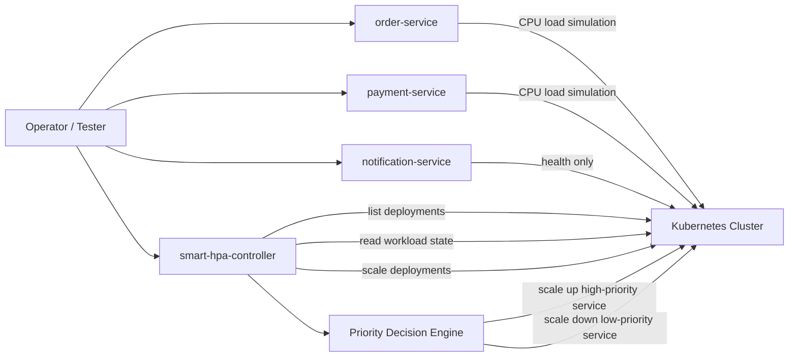

# 🚀 Priority-Aware Smart HPA for Kubernetes

A production-oriented proof of concept for **priority-based autoscaling in Kubernetes**. This repository models a small microservice system with three independently deployable workloads and a custom control-plane application, `smart-hpa-controller`, that makes scaling decisions based on **service criticality** rather than CPU thresholds alone. ⚖️

❗ The problem this project addresses is common in shared clusters: when compute capacity becomes constrained, traditional autoscaling can treat all workloads equally, even when some services are far more business-critical than others. This implementation introduces a **priority-aware scaling layer** that protects high-value services by redistributing capacity away from lower-priority workloads.

This repository is best suited for:

- 👩‍💻 Platform engineers exploring custom autoscaling strategies
- 🛠️ SRE teams evaluating Kubernetes control-plane extensions
- 🧑‍💻 Backend engineers learning how to combine Spring Boot services with Kubernetes-native automation
- 🧪 Teams prototyping business-priority-driven workload management

---

## 1. Project Overview 📦

The repository contains:

- 🥇 `order-service`: high-priority workload that simulates order-processing load
- 🥈 `payment-service`: medium-priority workload that simulates payment-processing load
- 🥉 `notification-service`: low-priority workload used as a deprioritizable workload
- 🧠 `smart-hpa-controller`: a Spring Boot application that inspects Kubernetes deployments, evaluates service priority, and scales workloads accordingly
- 📄 `k8s/`: Kubernetes deployment and service descriptors for the three demo workloads

At a business level, the system demonstrates how an organization can preserve core revenue-generating or customer-facing services during resource pressure by:

- 🔍 detecting overloaded high-priority workloads
- ⬇️ scaling down lower-priority workloads when possible
- ⬆️ scaling up the overloaded high-priority workload
- 📊 exposing both a REST API and a lightweight operational dashboard for observability

---

## 2. Architecture Overview 🏗️

### Architecture Style 🧩

This is a **microservices demo environment with a separate control-plane service**.

- 🧑‍💼 The three business services are stateless HTTP microservices
- 🤖 The `smart-hpa-controller` acts as a custom autoscaling orchestrator
- ☸️ Kubernetes is the deployment substrate and scaling execution layer
- 🔗 The controller communicates directly with the Kubernetes API using the Fabric8 client

### System Design 🛠️

- **Workload plane**: `order-service`, `payment-service`, `notification-service` 🏃
- **Control plane**: `smart-hpa-controller` 🧠
- **Exposure model**: NodePort services for demo accessibility 🌐
- **Interaction model**: REST endpoints for workload simulation and scaling actions 🔄

### Data / Control Flow 🔄



### Patterns Used 🧵

- **RESTful controller layer** for service APIs and controller actions
- **Service layer separation** in `smart-hpa-controller` for metrics, scaling, and decision logic
- **Scheduler-driven automation** using Spring’s `@Scheduled`
- **Model-driven policy evaluation** using `ServiceMetrics` and `ServicePriority`
- **Control-plane/data-plane split** for clean operational boundaries

---

## 3. Tech Stack 🛠️

| Category                | Technology                                    |
| ----------------------- | --------------------------------------------- |
| Language                | Java 17                                       |
| Backend Framework       | Spring Boot 4.0.1 for demo services           |
| Control Plane Framework | Spring Boot 3.2.0 for `smart-hpa-controller`  |
| Web Layer               | Spring Web MVC / Spring Web                   |
| UI                      | Thymeleaf dashboard in `smart-hpa-controller` |
| Kubernetes Integration  | Fabric8 Kubernetes Client 6.8.0               |
| Logging                 | SLF4J 2.0.9                                   |
| Build Tool              | Maven / Maven Wrapper                         |
| Container Runtime       | Docker with `eclipse-temurin:17-jre`          |
| Orchestration           | Kubernetes                                    |
| Testing                 | Spring Boot test support, JUnit 5             |
| Service Exposure        | NodePort Services                             |

### Database 🗄️

No database layer is present in this repository.

### External Integrations 🌐

- Kubernetes API via Fabric8 client
- No message brokers, caches, or external third-party services are implemented in the current codebase

---

## 4. Features & Functionalities ✨

### Core Features 🌟

- Priority-based scaling for Kubernetes deployments
- Manual scaling API for operational override
- Periodic automated scaling checks every 10 seconds
- Live cluster dashboard with service metrics and resource-exhaustion warning
- Separate demo services to simulate differentiated workloads
- Dockerized runtime for all three demo services
- Kubernetes manifests for service deployment and exposure

### Current Priority Model 🏅

The controller maps service names to priority tiers:

- `order-service` -> `HIGH`
- `payment-service` -> `MEDIUM`
- `notification-service` -> `LOW`

### Scaling Behavior 📈📉

When the controller detects a **high-priority service above 70% CPU**:

- it looks for a **low-priority service with more than one replica**
- it scales that low-priority service down by one replica
- it scales the overloaded high-priority service up by one replica

### Operational Visibility 👀

- `GET /dashboard` renders a web dashboard
- dashboard refreshes every 5 seconds
- services with CPU usage above 90% trigger a visible exhaustion alert

### Important Current Limitation ⚠️

The `MetricsService` currently uses **simulated CPU values via `Math.random()`** rather than querying the Kubernetes Metrics API. This means the control logic is structurally valid for a prototype, but the metrics source is still a demo stub rather than production telemetry.

---

## 5. Folder Structure 📁

```text
.
├── k8s/
├── order-service/
├── payment-service/
├── notification-service/
└── smart-hpa-controller/
```

### Why the Repository Is Structured This Way 🏗️

#### `k8s/` ☸️

Centralizes infrastructure definitions outside application code.

Why this matters:

- keeps deployment concerns decoupled from service implementation
- makes it easier to version infrastructure separately from code changes
- reflects how production teams usually manage workload descriptors

#### `order-service/`, `payment-service/`, `notification-service/` 🧩

Each service is isolated as an independent Spring Boot application.

Why this matters:

- each workload can be built, containerized, and scaled independently
- mirrors real microservice deployment topology
- makes autoscaling decisions meaningful because Kubernetes treats each deployment separately

These services are intentionally minimal because their role is to act as **scaling targets**, not full business domains.

#### `smart-hpa-controller/` 🧠

Contains the actual intelligence of the system.

Why this matters:

- separates autoscaling policy from workload code
- follows a control-plane architecture where one service orchestrates many workloads
- enables extension of policy logic without modifying the business services themselves

Inside this module:

- `controller/` exposes REST and dashboard endpoints
- `service/` encapsulates metrics retrieval, scaling, and policy evaluation
- `model/` defines the policy input objects
- `scheduler/` automates periodic monitoring
- `config/` wires Kubernetes client dependencies
- `resources/templates/` contains the Thymeleaf dashboard

### Notable Codebase Detail 📝

`smart-hpa-controller` also contains a legacy-style package under `com/smarthpa/smart_hpa_controller/` with an older prototype controller/service pair. The more structured implementation lives under `com/smarthpa/...` and is the primary architecture to build on.

---

## 6. Key Engineering Decisions 🛠️

### 1. Custom Controller Instead of Native HPA 🤖

The project uses a dedicated Spring Boot controller instead of relying only on Kubernetes HPA.

Why:

- native HPA is metric-driven but not business-priority-aware by default
- this design allows policy decisions such as sacrificing low-priority workloads to protect critical ones

Trade-off:

- greater control and domain alignment
- more operational and maintenance responsibility than built-in HPA alone

### 2. Fabric8 Kubernetes Client Over Shelling Out to `kubectl` ☸️

Why:

- provides programmatic, typed Kubernetes access
- keeps automation inside application code
- simplifies deployment discovery and scaling actions

Trade-off:

- adds a direct API dependency
- requires Kubernetes credentials and RBAC to be configured correctly

### 3. Separate Demo Workloads 🧪

Why:

- creates realistic deployment units for autoscaling experiments
- avoids coupling the scaling policy to a single monolithic application
- enables clear demonstration of differentiated business priority

Trade-off:

- service logic is intentionally shallow
- this repository is a scaling prototype, not a full end-to-end business platform

### 4. Thymeleaf Dashboard Instead of a Separate SPA 🖥️

Why:

- very low operational complexity
- good fit for lightweight admin/ops visualization
- avoids introducing frontend build tooling for a small internal dashboard

Trade-off:

- limited interactivity compared to a modern SPA
- suitable for operator visibility, not end-user workflows

### 5. Hardcoded Priority Mapping 🏷️

Why:

- simple and deterministic for a proof of concept
- easy to understand during demos

Trade-off:

- onboarding a new workload requires code changes
- production systems would typically externalize this into config, labels, annotations, or policy CRDs

---

## 7. Setup & Installation 🛠️

## Prerequisites 📋

- Java 17
- Maven 3.9+ for `smart-hpa-controller`
- Docker
- Kubernetes cluster or local cluster such as Minikube / Kind / Docker Desktop Kubernetes
- `kubectl` configured for the target cluster
- Access to the `default` namespace, or code changes if another namespace is required

## Configuration ⚙️

The repository contains minimal configuration in `application.yaml` files:

- `order-service`: port `8080`
- `payment-service`: port `8081`
- `notification-service`: port `8082`
- `smart-hpa-controller`: port `8090`

No application-specific environment variables are defined in the repository.

### Kubernetes Access ☸️

The controller builds a `KubernetesClient` using Fabric8 defaults. In practice this means it expects:

- a valid local kubeconfig, typically via default location or `KUBECONFIG`
- or an in-cluster service account when deployed inside Kubernetes

## Local Build 🏗️

### Demo Services 🧩

```bash
cd order-service
./mvnw clean package

cd ../payment-service
./mvnw clean package

cd ../notification-service
./mvnw clean package
```

On Windows:

```powershell
.\mvnw.cmd clean package
```

### Smart HPA Controller 🤖

```bash
cd smart-hpa-controller
mvn clean package
```

Note: this module does not include a Maven wrapper in the repository.

## Run Locally 🏃

### Demo Services 🧩

```bash
java -jar order-service/target/order-service-0.0.1-SNAPSHOT.jar
java -jar payment-service/target/payment-service-0.0.1-SNAPSHOT.jar
java -jar notification-service/target/notification-service-0.0.1-SNAPSHOT.jar
```

### Smart HPA Controller 🤖

```bash
java -jar smart-hpa-controller/target/smart-hpa-controller-0.0.1-SNAPSHOT.jar
```

If you are running the controller locally against a cluster, ensure your kubeconfig points to that cluster.

## Docker Build 🐳

```bash
docker build -t order-service:latest ./order-service
docker build -t payment-service:latest ./payment-service
docker build -t notification-service:latest ./notification-service
```

The Kubernetes manifests use:

- `imagePullPolicy: Never`
- local image tags such as `order-service:latest`

This strongly suggests a **local-cluster workflow** such as Minikube, Kind, or Docker Desktop Kubernetes where images are built directly into the cluster runtime or loaded manually.

## Kubernetes Deployment ☸️

```bash
kubectl apply -f k8s/order-deployment.yaml
kubectl apply -f k8s/order-service.yaml
kubectl apply -f k8s/payment-deployment.yaml
kubectl apply -f k8s/payment-service.yaml
kubectl apply -f k8s/notification-deployment.yaml
kubectl apply -f k8s/notification-service.yaml
```

### Exposed Service Ports 🌐

| Service              | Container Port | NodePort |
| -------------------- | -------------: | -------: |
| order-service        |           8080 |    30001 |
| payment-service      |           8081 |    30002 |
| notification-service |           8082 |    30003 |

### CI/CD 🔄

No CI/CD pipeline configuration is present in the repository.

---

## 8. API Documentation 📚

## Smart HPA Controller 🤖

### `POST /scale/{deployment}/{replicas}` 🔧

Manually scales a deployment in the `default` namespace.

Example:

```http
POST /scale/order-service/3
```

Response:

```text
Scaled order-service to 3 replicas
```

### `POST /smart-scale` ⚡

Triggers a priority-aware scaling evaluation.

Response shape:

```json
{
  "metrics": [
    {
      "serviceName": "order-service",
      "cpuUsage": 82.3,
      "replicas": 1,
      "priority": "HIGH"
    }
  ],
  "actions": [
    "High priority service order-service is overloaded (CPU: 82.30%)",
    "Scaling down low priority service notification-service from 2 to 1 replicas",
    "Scaling up high priority service order-service from 1 to 2 replicas"
  ],
  "status": "Scaling actions performed."
}
```

### `GET /dashboard` 📊

Renders a Thymeleaf-based HTML dashboard showing:

- service name
- priority
- CPU usage
- replica count
- cluster exhaustion warning

## Demo Workload Services 🧩

### Order Service 🥇

- `GET /order/health`
- `GET /order/load`

`/order/load` generates CPU load for roughly 3 seconds.

### Payment Service 🥈

- `GET /payment/health`
- `GET /payment/load`

`/payment/load` generates CPU load for roughly 3 seconds.

### Notification Service 🥉

- `GET /notify/health`

## Authentication 🔒

No authentication or authorization mechanism is implemented for these endpoints.

This is acceptable for a local prototype, but not for an internet-facing or multi-tenant production deployment.

---

## 9. UI/UX Overview 🖥️

The only UI in the repository is the operational dashboard served by `smart-hpa-controller`.

### Key UI Characteristics 🌈

- server-rendered HTML via Thymeleaf
- single-page dashboard
- auto-refresh every 5 seconds
- color-coded rows by service priority
- prominent alert banner when any service exceeds 90% CPU

### State Management 🧠

- no client-side state management library is used
- state is recomputed on every request from `MetricsService`

### Responsiveness & Accessibility ♿

Current UI is lightweight and functional, but basic.

Observations from the implementation:

- responsive behavior is limited
- semantic table layout is appropriate for ops data
- accessibility features such as ARIA landmarks, keyboard enhancements, and color-contrast validation are not explicitly implemented

---

## 10. Scalability & Performance 🚀

### What Supports Scale 📈

- stateless microservices packaged independently
- Kubernetes-native deployment model
- scaling decisions executed at deployment level
- control logic separated from workloads, which supports future policy evolution
- dynamic deployment discovery through Kubernetes API

### Current Performance Characteristics ⚡

- scheduler runs every 10 seconds
- dashboard refreshes every 5 seconds
- load endpoints intentionally create CPU pressure to test scaling
- order-service deployment includes CPU requests and limits, making it useful for resource-pressure experiments

### Current Gaps ⚠️

- no caching layer
- no pagination or bulk-cluster optimization
- no rate limiting on controller endpoints
- no backoff or circuit-breaking around Kubernetes API operations
- no asynchronous event stream; scaling is polling-based
- metrics are simulated rather than sourced from the Metrics API

### How the System Handles Growth Today 🌱

The structure can support more services, but practical scale is constrained by:

- hardcoded priority mapping
- namespace fixed to `default`
- simplistic single-metric decision logic
- lack of persistent state, audit trail, or policy history

---

## 11. Security Considerations 🔒

### Current State 🛡️

- no authentication on service or controller endpoints
- no authorization checks before manual scaling operations
- no namespace isolation controls in the REST API
- no input validation beyond Spring path variable typing
- no TLS or ingress configuration included in the repo
- no secrets, config maps, or RBAC manifests included

### Security Implications ⚠️

The `POST /scale/{deployment}/{replicas}` endpoint is powerful and should be treated as an administrative operation. In a production environment it should be protected by:

- authenticated access
- role-based authorization
- audit logging
- network restrictions
- namespace scoping
- replica bounds validation

### Kubernetes Access ☸️

Because the controller talks directly to the Kubernetes API, production deployment would require:

- least-privilege RBAC
- service account scoping
- cluster credential management
- secure kubeconfig handling for local development

---

## 12. Testing Strategy 🧪

### Tests Present in the Repository 📝

Each demo service contains a basic Spring Boot context-load test:

- `OrderServiceApplicationTests`
- `PaymentServiceApplicationTests`
- `NotificationServiceApplicationTests`

`smart-hpa-controller` also includes a context-load style test class.

### What the Existing Tests Cover ✅

- application startup wiring at a minimal level

### What Is Not Yet Covered ❌

- controller contract tests
- policy engine unit tests
- Kubernetes client mocking
- scheduler behavior tests
- integration tests against a real or mocked cluster
- end-to-end tests across workload generation and scaling decisions

### Practical Assessment 🧐

The current testing strategy is sufficient for initial scaffolding, but not yet for production confidence. The next priority should be deterministic tests around `PriorityDecisionEngine` and mocked integration tests for scaling execution.

---

## 13. Deployment 🚀

### Current Deployment Model 📦

- three demo services are containerized and deployable to Kubernetes via manifests in `k8s/`
- services are exposed through NodePort for easy local-cluster access
- `smart-hpa-controller` has application code but no Kubernetes manifest in this repository

### Environment Model 🌍

The repository implicitly supports:

- local development
- local Kubernetes testing
- prototype/demo environments

No separate configuration or deployment assets are provided for:

- staging
- production

### Hosting Assumption 🏠

Based on `imagePullPolicy: Never` and local image tags, the repo appears optimized for **local or workshop-style Kubernetes environments**, not a remote production registry workflow.

---

## 14. Future Improvements 🔮

- Replace random CPU generation with real `metrics.k8s.io` or Prometheus-backed telemetry
- Externalize priority assignment through Kubernetes labels, annotations, or config
- Add RBAC manifests and deploy `smart-hpa-controller` in-cluster
- Introduce bounded scaling rules, cooldown windows, and hysteresis
- Add policy audit logs and decision history
- Add integration tests with Kind or Testcontainers
- Unify Spring Boot versions across modules
- Remove or formalize the legacy prototype package inside `smart-hpa-controller`
- Add ingress, TLS, and authentication for administrative endpoints
- Expand workload simulation to include latency, queue depth, and memory pressure
- Support namespace configurability and multi-environment profiles

---

## 15. Contribution Guidelines 🤝

Contributions should preserve the repository’s core intent: demonstrating **priority-aware autoscaling** clearly and safely.

### Recommended Workflow 📝

1. Create a focused feature branch.
2. Keep workload-service changes independent from control-plane changes where possible.
3. Add or update tests for any scaling-policy modification.
4. Validate Kubernetes manifest changes alongside application changes.
5. Document new services, priorities, and operational behavior in this README.

### Contribution Standards 📏

- Prefer small, reviewable pull requests
- Keep service boundaries explicit
- Do not introduce hidden infrastructure assumptions
- If adding a new workload, also update priority resolution logic
- If modifying scaling policy, explain the business rationale and failure modes

---

## 16. Screenshot 🖼️


Figure 1.1: Verification of Kubernetes cluster status, running pods, CPU resource metrics, and Horizontal Pod Autoscaler (HPA) configuration using kubectl commands.


Figure 1.2: Kubernetes service configuration displaying ClusterIP and NodePort services for Order, Payment, and Notification microservices, enabling external access and internal communication within the cluster.


Figure 1.3: Verification of running Kubernetes pods and real-time resource utilization (CPU and memory) using kubectl commands, demonstrating active microservices and cluster monitoring.


Figure 1.4: Real-time monitoring of Horizontal Pod Autoscaler (HPA) showing CPU utilization and dynamic scaling of microservices based on defined thresholds.


Figure 1.5: Initial state of Horizontal Pod Autoscaler (HPA) showing low CPU utilization and minimum replica configuration before load generation.


Figure 1.6: Docker Desktop interface displaying running containers, including the Minikube cluster and microservice containers for Order, Payment, and Notification services.

---

## 17. Contact 📬

For any queries or support, feel free to reach out:

- 📧 **Email**: sdivakar2005@gmail.com
- 💼 **LinkedIn**: https://www.linkedin.com/in/divakar-srinivasan/
- 🐙 **GitHub**: [divakar-srinivasan](https://github.com/divakar-srinivasan)

---

---

Made with ❤️ by DIVAKAR S.
